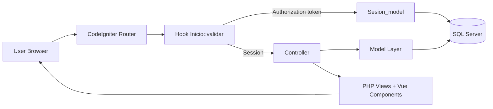
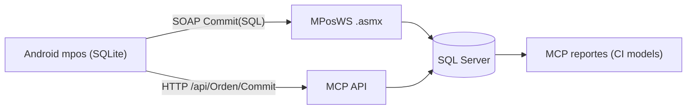

# Architecture Map

## Notes
- Hook mediation is central to access decisions.
- Most business logic terminates in CI models using SQL Server.
- Frontend is hybrid SSR + Vue.
- Route handling must not assume fixed folder depth (`mposbi`); runtime now depends on dynamic base URL + resilient controller parsing.

## MPOS Integration (Sub-Brain)

- Detailed trace and evidence: `subbrains/mpos/maps/fine-trace-mpos-mcp.md`.
