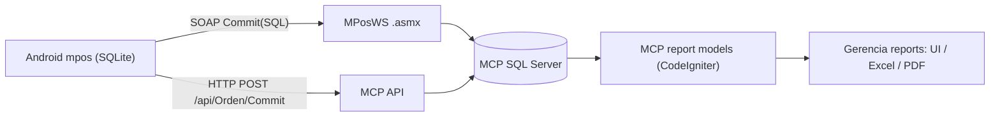

# Fine Trace MPOS -> MCP

## Executive Summary
`mpos` (Android Java) writes operational transactions in local SQLite (`D_FACTURA`, `D_FACTURAD`, `D_MOV`, `D_MOVD`, etc.), marks them pending with `STATCOM`, and pushes them to MCP mainly through SOAP `Commit(SQL)` calls. MCP reports consume these same transactional tables directly (`d_factura*`, `d_mov*`) and, in several sales reports, combine them with BOF tables (`d_venta_bof`, `d_ventad_bof`).

## Tags
- `MPOS_SYNC`
- `MPOS_D_FACTURA`
- `MPOS_D_MOV`
- `MPOS_WS`
- `KARDEX_DESIGN`

## Topology

## Evidence: Connectivity and Endpoint Resolution
- Default SOAP endpoint is loaded in app and overridable from SD file:
  - `mpos/app/src/main/java/com/dtsgt/base/AppMethods.java:1612`
  - `mpos/app/src/main/java/com/dtsgt/base/AppMethods.java:1613`
  - `mpos/app/src/main/java/com/dtsgt/base/AppMethods.java:1617`
  - `mpos/app/src/main/java/com/dtsgt/base/AppMethods.java:1622`
- Manifest confirms cleartext traffic and sync services:
  - `mpos/app/src/main/AndroidManifest.xml:45`
  - `mpos/app/src/main/AndroidManifest.xml:95`
  - `mpos/app/src/main/AndroidManifest.xml:126`
  - `mpos/app/src/main/AndroidManifest.xml:134`

## Evidence: SOAP/HTTP Transport
- SOAP base namespace: `http://tempuri.org/`:
  - `mpos/app/src/main/java/com/dtsgt/webservice/wsBase.java:16`
- SOAP `Commit` payload (`SQL`) and call:
  - `mpos/app/src/main/java/com/dtsgt/webservice/wsCommit.java:29`
  - `mpos/app/src/main/java/com/dtsgt/webservice/wsCommit.java:42`
  - `mpos/app/src/main/java/com/dtsgt/webservice/wsCommit.java:49`
- Generic SOAP builder (`callMethod`) adds `SOAPAction` dynamically:
  - `mpos/app/src/main/java/com/dtsgt/classes/WebService.java:71`
  - `mpos/app/src/main/java/com/dtsgt/classes/WebService.java:81`
- HTTP side channel (`api/Orden/Commit`) sends JSON `{ "sql": ... }`:
  - `mpos/app/src/main/java/com/dtsgt/webapi/HttpCommit.java:41`
  - `mpos/app/src/main/java/com/dtsgt/mpos/FacturaRes.java:4536`

## Evidence: Synchronization Orchestration
- Jobs and timer loop:
  - `mpos/app/src/main/java/com/dtsgt/webservice/startMainTimer.java:17`
  - `mpos/app/src/main/java/com/dtsgt/webservice/startOrdenImport.java:19`
  - `mpos/app/src/main/java/com/dtsgt/webservice/startPedidosImport.java:17`
  - `mpos/app/src/main/java/com/dtsgt/webservice/srvTimerService.java:59`
- Sync callback queue in `WSEnv` decides pending domain by `callback` and pushes `Commit`:
  - `mpos/app/src/main/java/com/dtsgt/mpos/WSEnv.java:226`
  - `mpos/app/src/main/java/com/dtsgt/mpos/WSEnv.java:232`
  - `mpos/app/src/main/java/com/dtsgt/mpos/WSEnv.java:239`
  - `mpos/app/src/main/java/com/dtsgt/mpos/WSEnv.java:275`
- Pending counters are calculated from `STATCOM`-driven local tables:
  - `mpos/app/src/main/java/com/dtsgt/mpos/WSEnv.java:1917`
  - `mpos/app/src/main/java/com/dtsgt/mpos/WSEnv.java:1931`
  - `mpos/app/src/main/java/com/dtsgt/mpos/WSEnv.java:1984`

## Evidence: POS Writes Sales in `D_FACTURA`
- Invoice header is written locally with `STATCOM='N'`:
  - `mpos/app/src/main/java/com/dtsgt/mpos/FacturaRes.java:1349`
  - `mpos/app/src/main/java/com/dtsgt/mpos/FacturaRes.java:1382`
- Invoice detail is written in `D_FACTURAD`:
  - `mpos/app/src/main/java/com/dtsgt/mpos/FacturaRes.java:1473`
  - `mpos/app/src/main/java/com/dtsgt/mpos/FacturaRes.java:1495`
- `WSEnv` packages and sends `D_FACTURA*`, then marks sent:
  - `mpos/app/src/main/java/com/dtsgt/mpos/WSEnv.java:699`
  - `mpos/app/src/main/java/com/dtsgt/mpos/WSEnv.java:709`
  - `mpos/app/src/main/java/com/dtsgt/mpos/WSEnv.java:1004`

## Evidence: Inventory Movements (`D_MOV`/`D_MOVD`)
- Local schema includes movement type and sync flag:
  - `mpos/app/src/main/java/com/dtsgt/base/BaseDatosScript.java:900`
  - `mpos/app/src/main/java/com/dtsgt/base/BaseDatosScript.java:905`
  - `mpos/app/src/main/java/com/dtsgt/base/BaseDatosScript.java:908`
  - `mpos/app/src/main/java/com/dtsgt/base/BaseDatosScript.java:924`
  - `mpos/app/src/main/java/com/dtsgt/base/BaseDatosScript.java:935`
- Movement type assignment in app flows:
  - `D` (ajuste): `mpos/app/src/main/java/com/dtsgt/mpos/InvAjuste.java:447`
  - `R` or `I` (recepcion/transfer behavior): `mpos/app/src/main/java/com/dtsgt/mpos/InvRecep.java:564`
  - `E` (egreso): `mpos/app/src/main/java/com/dtsgt/mpos/InvEgreso.java:391`
  - `R` (central): `mpos/app/src/main/java/com/dtsgt/mpos/InvCentral.java:489`
- Sync send and `STATCOM` update:
  - `mpos/app/src/main/java/com/dtsgt/mpos/WSEnv.java:1095`
  - `mpos/app/src/main/java/com/dtsgt/mpos/WSEnv.java:1098`
  - `mpos/app/src/main/java/com/dtsgt/mpos/WSEnv.java:1131`

## Evidence: Cost Update Pipeline
- Local cost transaction table and rule table definitions:
  - `mpos/app/src/main/java/com/dtsgt/base/BaseDatosVersion.java:1189`
  - `mpos/app/src/main/java/com/dtsgt/base/BaseDatosVersion.java:1196`
  - `mpos/app/src/main/java/com/dtsgt/base/BaseDatosVersion.java:1211`
- Inventory transaction writes `T_costo` and also updates `P_PRODUCTO.COSTO`:
  - `mpos/app/src/main/java/com/dtsgt/mpos/InvTrans.java:538`
  - `mpos/app/src/main/java/com/dtsgt/mpos/InvTrans.java:548`
  - `mpos/app/src/main/java/com/dtsgt/mpos/InvTrans.java:555`
- Sender pushes `T_costo` and executes product cost update SQL in server payload:
  - `mpos/app/src/main/java/com/dtsgt/mpos/WSEnv.java:1595`
  - `mpos/app/src/main/java/com/dtsgt/mpos/WSEnv.java:1602`
  - `mpos/app/src/main/java/com/dtsgt/mpos/WSEnv.java:2066`
  - `mpos/app/src/main/java/com/dtsgt/mpos/WSEnv.java:2105`

## Correlation Map: Device -> MCP DB -> Reports
| Device source (`mpos`) | Sync channel | MCP table target | Consumed in MCP reports |
|---|---|---|---|
| `D_FACTURA`, `D_FACTURAD` | SOAP `Commit(SQL)` | `d_factura`, `d_facturad` | `Ventas_gerencial_detalle`, `Familia_producto`, `Ventas_familia`, etc. |
| `D_MOV`, `D_MOVD` | SOAP `Commit(SQL)` | `d_mov`, `d_movd` | `Inventario`, `Ajustes_producto`, `Ingresos_producto`, `Existencias` |
| `D_MOV_ALMACEN`, `D_MOVD_ALMACEN` | SOAP `Commit(SQL)` | `d_mov_almacen`, `d_movd_almacen` | `Inventario`, `Existencias` |
| `T_costo` + `P_PRODUCTO.COSTO` update | SOAP `Commit(SQL)` | `d_costo` + `p_producto.costo` | Cost and margin calculations in sales reports currently read `p_producto.costo` |
| Nota envio pending SQL | HTTP `/api/Orden/Commit` | order-related tables | operational flows, not core sales report base |

## MCP-Side Correlation Evidence
- Sales report base combines POS + MCP BOF:
  - `mcp-azure/application/models/reportes/Ventas_gerencial_detalle_model.php:93`
- Sales margin/cost currently computed from `p_producto.costo` (not frozen transaction cost):
  - `mcp-azure/application/models/reportes/Ventas_gerencial_detalle_model.php:125`
  - `mcp-azure/application/models/reportes/Ventas_gerencial_detalle_model.php:172`
- Inventory report base for movements:
  - `mcp-azure/application/models/reportes/Inventario_model.php:16`

## Conclusion
- The requested assumption is confirmed: POS writes sales into `d_factura` lineage (via `D_FACTURA` local + sync).
- `d_mov`/`d_movd` are the canonical movement source to build Kardex.
- Cost semantics currently behave like "latest/update cost" with `T_costo` logging; weighted-average is not enforced in current report formulas.
