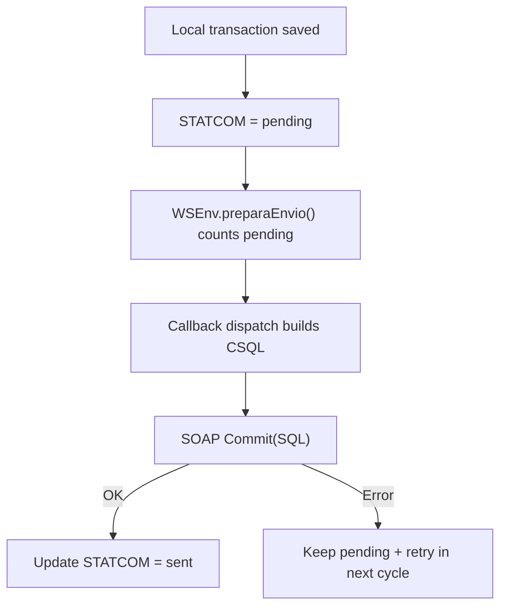

# Sync Orchestration Map (MPOS)

## Tags
- `MPOS_SYNC`
- `STATCOM_LIFECYCLE`
- `QUEUE_MODEL`

## Runtime Components
- `srvBaseJob` job wrapper:
  - `mpos/app/src/main/java/com/dtsgt/webservice/srvBaseJob.java:23`
  - `mpos/app/src/main/java/com/dtsgt/webservice/srvBaseJob.java:35`
- Recurring scheduler:
  - `mpos/app/src/main/java/com/dtsgt/webservice/startMainTimer.java:11`
  - `mpos/app/src/main/java/com/dtsgt/webservice/startMainTimer.java:17`
- Main loop worker:
  - `mpos/app/src/main/java/com/dtsgt/webservice/srvTimerService.java:12`
  - `mpos/app/src/main/java/com/dtsgt/webservice/srvTimerService.java:59`

## Trigger Inputs
- Manual/UI transaction creation (`FacturaRes`, `Inv*`, etc.)
- Timer jobs (`JobScheduler`)
- Network receiver (`fbNetworkState`):
  - `mpos/app/src/main/java/com/dtsgt/firebase/fbNetworkState.java:25`
- Firebase push (`MyFirebaseMessagingService` + `WorkManager`):
  - `mpos/app/src/main/java/com/dtsgt/firebase/MyFirebaseMessagingService.java:90`

## Queue and State Model
`STATCOM` is the dominant pending/sent marker.

Typical lifecycle:
1. Local insert marks record as pending (`N` or `0` depending table).
2. `WSEnv.preparaEnvio()` counts pending entities by table.
3. Callback dispatcher builds `CSQL` batches.
4. SOAP `Commit(SQL)` is executed.
5. On success, table is marked as sent (`S` or `1`).

Evidence:
- Pending read:
  - `mpos/app/src/main/java/com/dtsgt/mpos/WSEnv.java:1917`
  - `mpos/app/src/main/java/com/dtsgt/mpos/WSEnv.java:1931`
  - `mpos/app/src/main/java/com/dtsgt/mpos/WSEnv.java:1984`
- Success mark examples:
  - `mpos/app/src/main/java/com/dtsgt/mpos/WSEnv.java:1004`
  - `mpos/app/src/main/java/com/dtsgt/mpos/WSEnv.java:1131`
  - `mpos/app/src/main/java/com/dtsgt/mpos/WSEnv.java:1610`

## Main Sync Dispatch (WSEnv callback)
- `callback=2`: invoices (`processFactura`)
- `callback=3`: annulments + inventory movements (`processAnul` + `processMov`)
- `callback=10`: costs (`processCosto`)
- `callback=12`: warehouse movement (`processMovAlmacen`)
- plus caja/FEL/CxC/deposito/order-status/provider-location queues.

Evidence:
- `mpos/app/src/main/java/com/dtsgt/mpos/WSEnv.java:226`
- `mpos/app/src/main/java/com/dtsgt/mpos/WSEnv.java:232`
- `mpos/app/src/main/java/com/dtsgt/mpos/WSEnv.java:239`
- `mpos/app/src/main/java/com/dtsgt/mpos/WSEnv.java:275`

## Diagram

## Compatibility Notes
- There is also a legacy/manual sender in `ComWS` with similar `STATCOM` semantics:
  - `mpos/app/src/main/java/com/dtsgt/mpos/ComWS.java:457`
  - `mpos/app/src/main/java/com/dtsgt/mpos/ComWS.java:1838`
  - `mpos/app/src/main/java/com/dtsgt/mpos/ComWS.java:2506`
